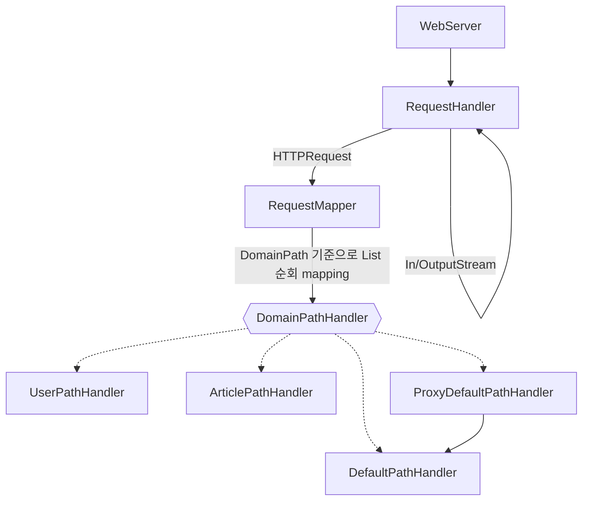
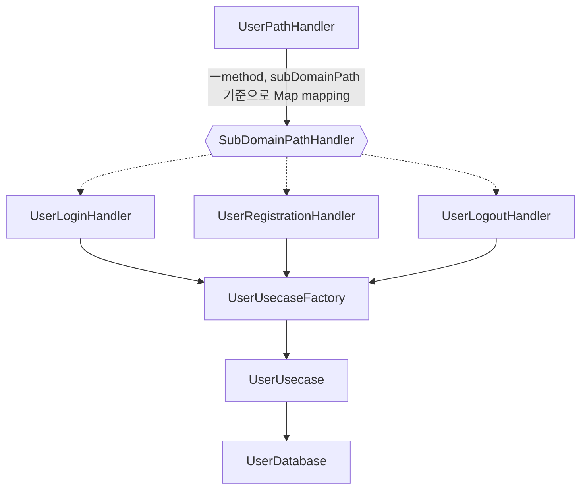

# ✅ 1. 리뷰
## 오늘 한 것
### 1. 전체 코드 다이어그램 그리기
- 코드 리뷰를 위해서 다이어그램을 그릴 필요가 있었다.
- mermaid라는 툴을 사용해서 전체 코드에 대한 flow chart를 그렸다.

### 2. 초단기 날씨 API 문서 분석
- 종프 회의를 앞두고 기상청, 농촌진흥청, OpenWeather API 문서를 읽어보았다. 
- 테스트 인증키로 url 요청을 보내보았다. 

### 3. 종프 회의
- 기능 명세서를 받고 질문이나 피드백을 정리했다. 

## 작업 과정에서 배운 것
### 1. 코드 리뷰할 때 전체 구조를 먼저 설명
- 지난주 스쿼드 세션 때 큰 볼륨의 프로젝트를 설명하는데 어려움을 겪었다.
- 이번엔 바로 코드 레벨에서 설명하는 것이 아니라 전체 구조를 먼저 설명하려고 Mermaid 툴을 사용해서 다이어그램을 그렸다. 
- Flow Chart로 전체 흐름을 설명하고 코드 레벨에서 세세한 의도를 설명하니 코드 설명이 한결 쉬웠다.

### 2. 삼인행필유아사(三人行必有我師)
- 세 사람만 모여도 서로의 스승이 되어줄 수 있다. 누구에게나 배울점이 있다는 뜻이다. 
- 코드 리뷰를 하면서 나도 배운점이 많고 반대로 내가 인사이트를 준 부분도 있다. 
- 수환님의 코드에 많은 고민의 흔적이 보였고, 그걸 구현하기 위해 자바의 기능을 많이 활용했다는 것을 느꼈다. 
- 상대적으로 위축되어 있었는데 내 코드에서 동적 HTML 생성과 프록시 패턴을 적용한 부분에서 수환님도 인사이트를 느꼈다고 하셨고 나의 고민이 누군가에게 인사이트를 주었다는 것이 기뻤다.  

## 어려웠던 점
### 1. 자바의 기본 문법 학습 부족
- 자바의 Generic을 활용하지 못하고 있다.
- 자바의 reflection을 몰라서 코드 리뷰에 어려움이 있었다.

# 🤔 2. 회고 (KPT)
## Keep (잘한점)
### 1. 코드 리뷰의 체계가 잡힘.
2주차 스쿼드 세션에서 큰 볼륨의 프로젝트를 어떻게 설명해야 할지 막막했는데, flow chart를 설명하는 것으로 나름의 해결책을 만들었다. 
반복된 코드 리뷰를 통해 개발적으로뿐만 아니라 논리정연한 사람으로 성장하는 느낌이라 좋다.

## Problem (개선할 점)
### 1. 요구사항을 꼼꼼히 읽자. 
3주차 요구사항 중에 게시글 구현과 이미지 업로드 구현에 대해서 PR을 구분해서 보내라는 것이 있었다. 
그것도 모르고 한 번에 이미지 업로드까지 구현하다가 PR을 어떻게 보내야 할지 막막해졌다. 

### 2. 모르는 것을 부끄러워 하지 말자.
코드 리뷰를 하면서 reflection, Generic 등 이해가 부족한 나를 발견했고, 부끄럽다고 느꼈다. 
하지만 모른는 것을 발견했다는 것은 기쁜 일이다. 배울 수 있음에 감사하고 정진하자. 

## Try (해결책)
- 요구사항을 보고 TODO list를 세부적으로 정리하고 시작하면 요구사항을 놓치는 일이 적을 것 같다. 
- 모른다는 것에 주눅들지 말자.

## 자체 평가
종프의 주제와 기능이 구체화되어감에 따라 점점 프로젝트를 시작해야 한다는 압박감이 생긴다. 당장 과제도 해야하고 
할 일은 태산인데 24시간이 짧다는 느낌이 든다. 이럴 때일수록 할 일을 체계적으로 나눠서 계획적으로 움직여야겠다는 생각이 든다. 

코드 리뷰 시간이 두려우면서도 즐겁다. 모른다는 것이 처음엔 부끄러웠는데 다시 생각해보니 새로 배운점이 있다는 뜻이고, 앞으로 내가 
어떤 부분을 더 공부하면 되는지 방향이 잡힌 것이다. 두려워하지 말고 모르는 것이 생기면 동료를 적극 활용하자. 

# 📚 3. 학습 내용

# 💁‍ Todo list
- [x] mermaid로 다이어그램 그려보기
- [x] 날씨 API 문서 다 읽기 
  - [x] 기상청
  - [x] 농촌진흥청
  - [x] Open Weather
- [x] 그룹세션
  - [x] 그룹원들 코드 뜯어보기
- [ ] 3주차 과제 
  - [x] 이미지 업로드 기능 추가하기
  - [ ] index.html에서 이미지 보여주기
  - [ ] mypage에 프로필 이미지 변경하기
  - [ ] index.html에서 프로필 보여주기
  - [ ] DB 연동 (H2, JDBC) --> 게시글 저장
  - [ ] javadoc 학습하기
  - [ ] 클래스, public 메소드에 javadoc 형식의 주석
  - [ ] Github Pages로 배포하기

# ✏️ 끄적끄적
오전 jvm 강의
Class Loader의 3단계 --> 로딩,링킹,초기화
jvm의 특징 : Class Loader는 동적인 로딩이 가능하다. --> 성능, 유연성에 영향을 준다. 런타임 시에 필요한 파일을 로드한다. 
동적로딩
1. 런타임 시에 필요할 떄 올린다.
2. 한 번만 올린다.
추신: 동적로딩이니까 미리 호출하는 warm up 단계도 있다. 

GC의 기본 알고리즘 
mark & sweep
메소드 영역도 GC의 대상이다. 

인터프리터는 바이트 코드를 한 줄 씩 '해석'하고 '실행'하는 것이다. (기계어로 번역한다고 하면 살짝 공격당할 요소가 많다.)
거기서 자주쓰는 코드는 JIT 컴파일러로 기계어로 만들어 캐싱 해놓는 것이다. (얘는 기계어 번역이 맞다)

Native Method Stack 
native code에 관련한 정보가 들어간다.

`Thread safe`
힙에서 저장, 장점: 힙에 저장, 메모리 적게 사용, 단점: lock에 의해서 느려진다. 
1. volatile
2. atomic
3. synchronized
4. thread local

